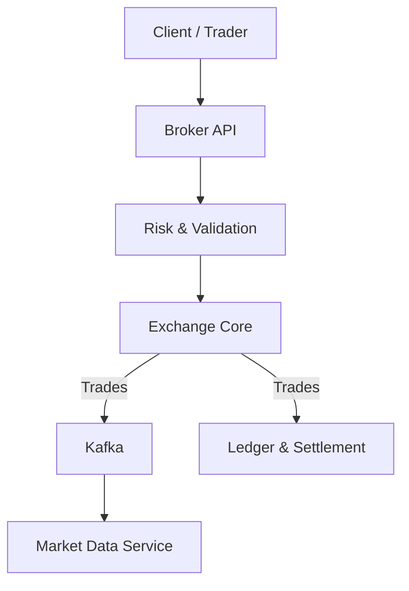

# TRADESIM: A Distributed Trading Exchange Simulator

Robust, event-driven backend that simulates how real exchanges discover price, route orders, stream market data, and settle trades. It focuses on correctness, latency, and observability — not building a UI trading app.

<p align="center">
  <em>Mini-NSE Matching Engine + Broker Layer + Kafka-powered Market Data</em>
</p>

---

## Highlights

- **Matching Engine:** Price–time priority, partial fills, deterministic execution
- **Broker Layer:** Accounts, balances, risk validation, order routing
- **Market Data:** Real-time ticks, best bid/ask, depth snapshots, replayable streams
- **Ledger & Settlement:** Atomic double-entry accounting, immutable records
- **Observability:** Structured logs, metrics, DLQs, circuit breakers

## Architecture

The system is composed of independent microservices communicating asynchronously over Kafka. Inspired by modern payment/exchange systems (see attachment for reference styling).



## Core Components

### Exchange Core (Matching Engine)

- In-memory `OrderBook` with price–time priority matching
- Limit and market orders; partial fills; deterministic trade execution
- Tech: Java (multithreaded), zero external DB dependency

### Broker Service

- Accounts, balances, and positions; pre-trade risk checks
- Route validated orders to the exchange core
- Tech: Node.js (REST) or Spring Boot; Redis for fast risk checks

### Market Data Engine

- Real-time trade ticks; best bid/ask; depth snapshots
- Replayable streams and WebSockets
- Tech: Apache Kafka, Kafka Streams, WebSockets

### Ledger & Settlement

- Atomic double-entry accounting; immutable trade records
- Simulated T+1 settlement; auditable history
- Tech: PostgreSQL with transactional guarantees

## Tech Stack

- Java, Go, Node.js, Spring Boot
- Apache Kafka, Kafka Streams, Redis, PostgreSQL
- Docker; CI/CD via GitHub Actions; cloud-ready (AWS/GCP)
- OpenTelemetry, Prometheus, Grafana for observability

## Repository Layout

```
tradesim/
├── exchange-core/        # Matching engine
├── broker-service/       # Broker APIs & risk checks
├── market-data-service/  # Kafka streams & WebSockets
├── ledger-service/       # Double-entry accounting
├── infra/                # Docker, Kafka, scripts
└── docs/                 # Architecture & design docs
```

- Exchange core entrypoint: [exchange-core/src/main/java/com/tradesim/exchange/Main.java](exchange-core/src/main/java/com/tradesim/exchange/Main.java)
- Matching engine: [exchange-core/src/main/java/com/tradesim/exchange/MatchingEngine.java](exchange-core/src/main/java/com/tradesim/exchange/MatchingEngine.java)
- Broker service server: [broker-service/src/server.js](broker-service/src/server.js)
- Market data streams: [market-data-service/src/stream.js](market-data-service/src/stream.js), [market-data-service/src/websocket.js](market-data-service/src/websocket.js)
- Ledger service: [ledger-service/src/ledger.js](ledger-service/src/ledger.js)
- Local scripts: [infra/scripts/start-local.sh](infra/scripts/start-local.sh), [infra/scripts/stop-local.sh](infra/scripts/stop-local.sh)

## Quick Start (Local)

Prerequisites: Docker, Docker Compose; optional Java 17+, Node.js 20+ for local service dev.

### Option A: Helper scripts

```bash
./infra/scripts/start-local.sh
# ... run and test ...
./infra/scripts/stop-local.sh
```

### Option B: Docker Compose

```bash
docker compose up -d
# to stop
docker compose down
```

### Service Endpoints (examples)

- Broker API routes: see [broker-service/src/routes.js](broker-service/src/routes.js) and [docs/api/broker-api.md](docs/api/broker-api.md)
- Market data API: [docs/api/market-data-api.md](docs/api/market-data-api.md)

## Code Examples

Below are lightweight demo snippets to illustrate how clients might interact with the broker and market data services. Endpoints are placeholders — adapt to the actual routes in [broker-service/src/routes.js](broker-service/src/routes.js) and the market data service.

### TypeScript: Submit a Limit Order via Broker API

```ts
type Side = "BUY" | "SELL";
type OrderType = "LIMIT" | "MARKET";

interface OrderRequest {
  symbol: string;
  side: Side;
  type: OrderType;
  price?: number;
  quantity: number;
  clientId: string;
}

interface OrderResponse {
  orderId: string;
  status: "ACCEPTED" | "REJECTED";
  reason?: string;
}

const BASE = process.env.BROKER_URL ?? "http://localhost:8080";

async function placeOrder(req: OrderRequest): Promise<OrderResponse> {
  const res = await fetch(`${BASE}/api/v1/orders`, {
    method: "POST",
    headers: { "content-type": "application/json" },
    body: JSON.stringify(req),
  });
  if (!res.ok) throw new Error(`HTTP ${res.status}: ${await res.text()}`);
  return res.json() as Promise<OrderResponse>;
}

placeOrder({
  symbol: "TSIM",
  side: "BUY",
  type: "LIMIT",
  price: 101.25,
  quantity: 50,
  clientId: "demo-client",
})
  .then((o) => console.log("Order response:", o))
  .catch((err) => console.error("Order error:", err));
```

Run with Node 20+ (native `fetch`) or Deno/Bun.

### JavaScript: Subscribe to Market Data via WebSocket

```js
// Browser example — open the console to see ticks.
const symbol = "TSIM";
const ws = new WebSocket(`ws://localhost:8082/market/ticks?symbol=${symbol}`);

ws.onopen = () => console.log("Connected to market data");
ws.onmessage = (evt) => {
  const tick = JSON.parse(evt.data);
  // { ts, symbol, price, size, side }
  console.log("Tick:", tick);
};
ws.onclose = () => console.log("Disconnected");
ws.onerror = (e) => console.error("WebSocket error", e);
```

For Node, use the `ws` package and replace `WebSocket` with `require('ws')`.

### JavaScript: Consume Trade Events from Kafka

```js
// Minimal consumer using kafkajs
const { Kafka } = require("kafkajs");

async function main() {
  const kafka = new Kafka({
    clientId: "tradesim-demo",
    brokers: ["localhost:9092"],
  });
  const consumer = kafka.consumer({ groupId: "demo-trades" });
  await consumer.connect();
  await consumer.subscribe({ topic: "trades", fromBeginning: false });
  await consumer.run({
    eachMessage: async ({ topic, partition, message }) => {
      const payload = message.value?.toString() ?? "{}";
      const trade = JSON.parse(payload);
      console.log("Trade:", trade);
    },
  });
}

main().catch(console.error);
```

Topics and schemas can be customized in [infra/kafka/topics.yaml](infra/kafka/topics.yaml).

## Development

Use individual service folders for local iteration; build and run with your preferred toolchain.

### Exchange Core (Java)

- Build: `mvn -q -f exchange-core/pom.xml package`
- Run: `java -jar exchange-core/target/exchange-core-*.jar`

### Broker / Market / Ledger (Node.js)

- Install: `npm install` inside each service folder
- Dev run: `npm run dev` (when available)

## Documentation

- Architecture overview: [docs/architecture/overview.md](docs/architecture/overview.md)
- Event flow: [docs/architecture/event-flow.md](docs/architecture/event-flow.md)
- Matching engine design: [docs/design/matching-engine.md](docs/design/matching-engine.md)
- Order book: [docs/design/order-book.md](docs/design/order-book.md)
- Settlement: [docs/design/settlement.md](docs/design/settlement.md)
- Kafka runbook: [docs/runbooks/kafka.md](docs/runbooks/kafka.md)
- Local setup: [docs/runbooks/local-setup.md](docs/runbooks/local-setup.md)
- Troubleshooting: [docs/runbooks/troubleshooting.md](docs/runbooks/troubleshooting.md)

## Roadmap

- Core matching engine
- Broker APIs
- Kafka-based order flow
- Market data streaming
- Settlement & ledger
- Observability & metrics
- Stress testing

## Status

🚧 Under active development — architecture, APIs, and internals may evolve.

## License

Licensed under MIT. See [LICENSE](LICENSE).
